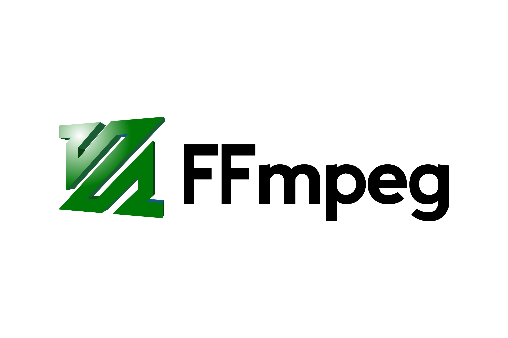

l#  Scroll-based Canvas Animation with GSAP and TailwindCSS

This project demonstrates how to create a **smooth scroll-driven frame-by-frame animation** using HTML5 `<canvas>`, GSAP `ScrollTrigger`, and TailwindCSS for styling. Ideal for interactive storytelling, 3D animations, or showcasing high-quality frame sequences.

#  Demo Preview

<p align="center">
  
  
</p>

 ---

##  Features
-  Scroll-based image sequence animation using `GSAP & ScrollTrigger`
-  Smooth high-quality canvas rendering with `imageSmoothing`
-  Responsive canvas scaling logic (maintains image aspect ratio)
-  Sticky canvas scroll area spanning multiple view heights
-  Uses [GSAP](https://greensock.com/gsap/) and [TailwindCSS](https://tailwindcss.com/)
- 📁 Preloads all images for smooth playback

---

##  How It Works

### Canvas & Frame Logic

- A `<canvas>` fills the screen (`w-full h-screen`) and is sticky during the scroll.
- 382 frames are preloaded from `frames01/frame_0001.jpeg` to `frame_0382.jpeg`.
- Each frame is rendered to the canvas based on scroll progress using GSAP's timeline.
- Canvas automatically resizes and scales the images with maintained aspect ratio.

### GSAP ScrollTrigger

- Tied to the `.parent` container (`height: 700vh`) to allow extended scrolling.
- Updates the `frames.currentIndex` and calls `loadImage()` on scroll.

---

##  Technologies Used

| Tech                          | Usage                            |
|-------------------------------|----------------------------------|
| HTML5                         | Canvas structure                 |
| TailwindCSS                   | Layout & utility styling         |
| GSAP                          | ScrollTrigger animation          |
| JavaScript                    | Image preloading & frame control |
| [FFmpeg](https://ffmpeg.org/) | cutting all frames from the video|

<p align="left">
  
 </p>

---


## ✅ Setup Instructions

1. Clone the repository:
   ```bash
   git clone https://github.com/EmamSaimon592/scroll-canvas-animation.git

   cd scroll-canvas-animation
   ```

2. Add your image sequence:

   Place frame_0001.jpeg to frame_0382.jpeg inside the frames01/ directory.

   Open index.html in your browser to see the animation.

---

## Customization

1. Change Frame Count:

   <b>Update this value in the script:</b>

   ```bash
   maxIndex: 382
   ```

2. Image Path:

   <b>Update the frame path if you change folder structure:</b>

   ```bash
   const imageUrl = `./frames01/frame_${i.toString().padStart(4, "0")}.jpeg`;
   ```
3. Scroll Length:

   <b>Change height of .parent for longer/shorter animation scroll:</b>

   ```bash
   <div class="parent relative w-full h-[700vh]">
   ```
---

## Notes

 Ensure all frames are <b>named sequentially</b> and padded (example, frame_0001.jpeg).

 Use optimized JPEGs or WebP for better performance.

 You can host your project on GitHub Pages or Vercel for live preview.

---

# Author
 <b>Emam Saimon</b>

 Bsc in CSE

github: https://github.com/EmamSaimon592
